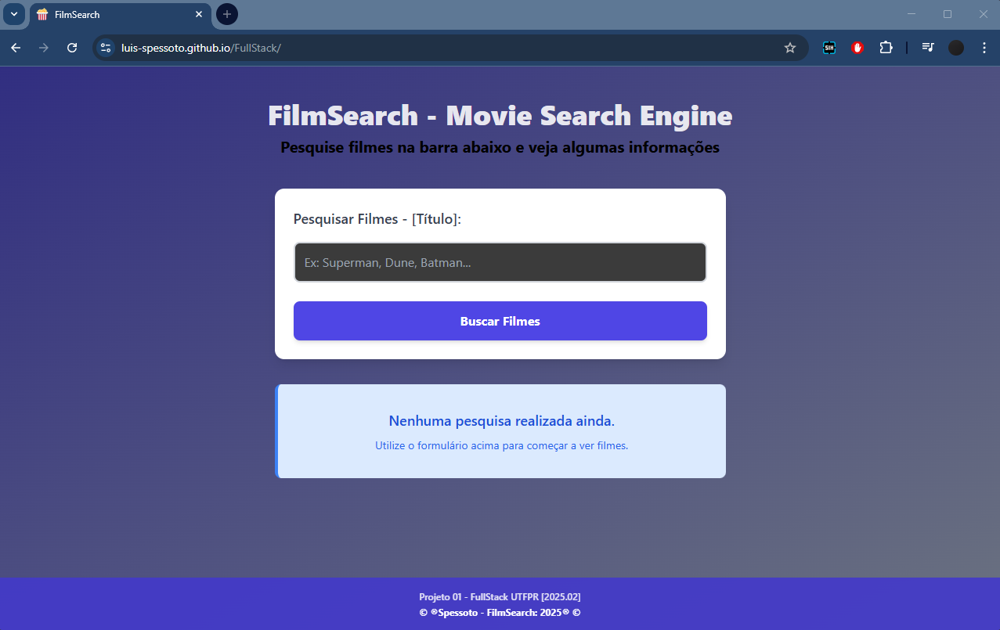
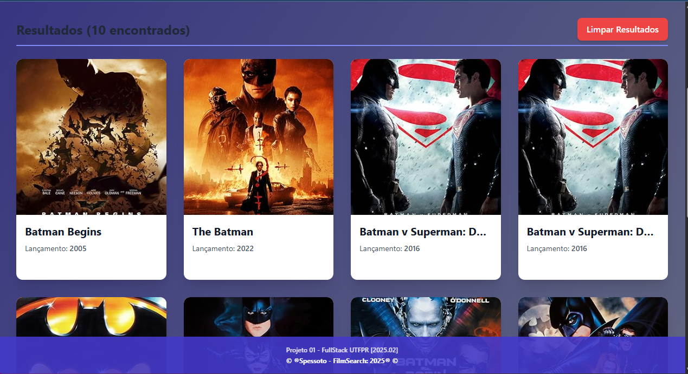

# <h1 align="center">🍿🎞️ FilmSearch 🎞️🍿</h1>
# <p align="center"> Projeto da matéria - Web Fullstack 2025/02 </p>

<div align="center">
 <figure>
  
  <figcaption>Layout do website</figcaption>
 </figure>
</div>

# Integrantes do grupo: <br>
<markdown-accessiblity-table data-catalyst=""><table tabindex="0">
<thead>
  <tr>
    <th align="center"><a href="https://github.com/Luis-Spessoto"><br><sub>Luís Felipe Spessoto</sub></a></th>
  </tr>
</thead>
</table></markdown-accessiblity-table>

# Descrição do projeto: 
Website criado na matéria Web Fullstack 2025/02 utlizando React.js

- Hook: <a href="https://www.w3schools.com/react/react_usememo.asp">useMemo</a> -> Utilizado no arquivo 'SearchContextAPI.jsx' para memorizar o objeto 'contextValue', previnindo que os componentes consumidores (SearchForm, SearchResult) sejam re-renderizados desnecessariamente, pois garante que o objeto do Contexto só será recriado quando o estado fundamental (como results, loading, ou error) for atualizado.
  <br>
- Biblioteca React.js: <a href="https://react-hook-form.com/">React Hook Form</a> -> Utilizada para otimizar a criação e gerenciamento de formulários. A biblioteca implementa o controle de estado e a validação do campo de busca, garantindo que a requisição de API só seja disparada quando os dados de entrada forem válidos.
  <br>
- API: <a href="https://www.omdbapi.com/">OMDB Public API</a> -> Utilizada para extrair informações sobre diversos filmes requiridos pelo formulário de input da aplicação

<div align="center">
 <figure>
  
  <figcaption>Exemplo de pesquisa na aplicação [Requisição do input para a API]</figcaption>
 </figure>
</div>

## Estrutura do projeto

```bash
FullStack/
├── dist/                                   #Pasta de deployment ('npm run build')
├── node_modules/                           #Dependências do projeto (npm install)
├── public/                                 #Imagens estáticas (favicons, imagens de logo)
│   ├── iconPop.png                         
│   ├── MovieCards.png                      
│   └── Screenshot.png                      
├── src/                                    #Código-fonte da aplicação 
│   ├── API/                                #Contém toda a lógica de requisições
│   │   └── SearchContextAPI.jsx            #Contém o Context API, lógica AJAX e mapeamento de dados da API (OMDb)
│   ├── components/                         #Componentes reutilizáveis 
│   │   ├── SearchForm.jsx                  #Formulário de busca e validação (React Hook Form)
│   │   ├── SearchResult.jsx                #Exibe a lista de filmes, loading e mensagens de erro
│   │   └── Movie.jsx                       #Renderiza o card individual dos filmes
│   ├── App.jsx                             #Componente principal (SPA) 
│   ├── App.css                             
│   ├── index.css                           #Estilos globais e configurações de fonte
│   └── main.jsx                            #Ponto de entrada do React (renderiza o App)
├── index.html                              #Base do HTML e carregamento do Tailwind CSS para estilização local dos componentes
├── README.md                               
├── package-lock.json                       
├── vite.config.js                          
└── package.json                           
